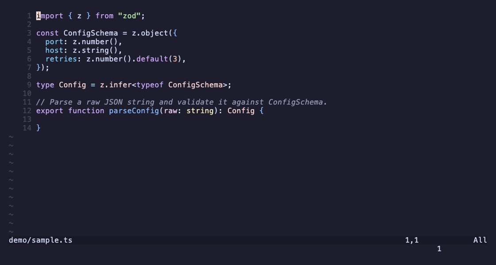

# claude-complete.nvim

AI code completion for Neovim, powered by the [Claude Code](https://www.claude.com/product/claude-code) CLI.

Two lanes, both rendered as ghost text you accept with `<Tab>`:

- **Manual (`<C-g>`)** — the deep lane. Claude reads the surrounding code (imports, the cursor window, LSP diagnostics, open buffers, the project tree), explores the project with its tools when it needs to, and returns a considered multi-line completion. Best model: `sonnet`.
- **Auto** *(opt-in)* — a fast, Cursor-style lane. As you pause typing, a lightweight persistent worker returns a short continuation from the code around your cursor. Meant as a Copilot replacement powered by your Claude subscription. Best model: `claude-haiku-4-5`.



## Requirements

- Neovim >= 0.10
- The `claude` CLI on your `PATH`, authenticated (`claude` once to sign in)
- Optional: [snacks.nvim](https://github.com/folke/snacks.nvim) for the rich tool-activity panel (a clean cmdline spinner is used otherwise)

## Install

With [lazy.nvim](https://github.com/folke/lazy.nvim):

```lua
{
  "ramanshrivastava/claude-complete.nvim",
  event = "InsertEnter",
  opts = {},
}
```

## Usage

| Key (insert mode) | Action |
| --- | --- |
| `<C-g>` | Request a completion at the cursor |
| `<Tab>` | Accept the suggestion |
| `<C-c>` | Cancel an in-flight request |

All keys are configurable (see below). Typing, leaving insert mode, or moving the cursor dismisses the suggestion.

### The automatic lane

Off by default. Turn it on in `opts` (`auto = { enabled = true }`) or at runtime:

| Command | Action |
| --- | --- |
| `:ClaudeCompleteAuto on` | Enable the auto lane |
| `:ClaudeCompleteAuto off` | Disable it and stop the worker |
| `:ClaudeCompleteAuto toggle` | Toggle (default when no argument) |

Once on, pause while typing in insert mode and a completion appears as ghost text; `<Tab>` accepts it (same key and machinery as the manual lane). Any further keystroke dismisses it and, after the debounce, requests a fresh one.

**How it differs from `<C-g>`:** the manual lane spawns a fresh agent per request with rich, tool-using context — great for substantial multi-line code you couldn't easily type. The auto lane keeps **one long-lived `claude` process** and sends it a small fill-in-the-middle prompt (~60 lines above the cursor, ~20 below) for a short, single-shot continuation. It never uses tools and stays out of the way (skips large files, prose pickers, and whenever a completion menu or the manual lane is active).

**Latency:** the persistent worker avoids per-request startup, and it disables the model's extended "thinking" (`MAX_THINKING_TOKENS=0`, worker-only) since that was the dominant latency tail. With `claude-haiku-4-5` expect a **~4 s** first request after an idle period (the worker cold-starts) settling to **~2 s** for subsequent completions — down from ~6 s / ~4 s with thinking enabled. Still slower than a purpose-built FIM endpoint; the trade-off for running entirely through the Claude CLI with no extra API keys. Override the worker env via `auto.worker_env` (set it to `{}` to re-enable thinking).

**Quota / cost:** the auto lane runs on **your Claude subscription** through the CLI — no separate API key. Because it fires on every typing pause it is chattier than the manual lane, so a cheap fast model (`claude-haiku-4-5`, the default) is strongly recommended. The worker shuts itself down after 10 idle minutes and repeated failures disable the lane for the session (with one notification) rather than retrying forever.

## Configuration

`opts` is merged over the defaults:

```lua
{
  command = "claude",        -- CLI to invoke
  model = "sonnet",          -- passed as --model
  cli_args = {               -- extra flags (--model is appended automatically)
    "-p", "--max-turns", "100", "--output-format", "stream-json",
    "--verbose", "--permission-mode", "bypassPermissions",
  },
  timeout_ms = 60000,
  keymaps = {                -- set any to false to leave it unbound
    trigger = "<C-g>",
    accept = "<Tab>",
    cancel = "<C-c>",
  },
  context = {
    inline_full_under = 300, -- send the whole file when shorter than this
    above = 150,             -- otherwise lines kept above the cursor
    below = 50,              -- and below
    imports = 20,            -- leading lines always included
    diagnostics = 5,         -- nearest LSP diagnostics to include
    tree = 15,               -- top-level project-tree entries
  },
  auto = {                   -- the automatic, Cursor-style lane (opt-in)
    enabled = false,         -- off by default
    model = "claude-haiku-4-5", -- a cheap, fast model is strongly recommended
    debounce_ms = 350,       -- idle time before a completion is requested
    idle_shutdown_min = 10,  -- stop the worker after this many idle minutes
    max_filesize_kb = 500,   -- skip buffers larger than this
    max_lines = 10000,       -- skip buffers with more lines than this
    disabled_filetypes = { "TelescopePrompt", "snacks_picker_input", "oil" },
    worker_env = { MAX_THINKING_TOKENS = "0" }, -- worker-only env; {} re-enables thinking
  },
  system_prompt = nil,       -- string to replace the built-in prompt (manual lane)
  highlights = {
    ghost = { link = "Comment" }, -- or { fg = "#b4befe", italic = true }
  },
  ui = { rich = true },      -- rich snacks panel when available, else cmdline spinner
}
```

### Custom keys via lazy

```lua
{
  "ramanshrivastava/claude-complete.nvim",
  keys = { { "<C-g>", mode = "i" } },
  opts = { keymaps = { trigger = "<C-g>", accept = "<Tab>" } },
}
```

## How it works

The **manual lane** shells out to a fresh `claude -p` with `--output-format stream-json` per request, sends the gathered context on stdin under a code-only `--system-prompt`, streams the tool-use events to drive the progress panel, sanitizes the result (stripping any stray markdown fences or output-style prose), and renders it as ghost text.

The **auto lane** starts one persistent `claude -p --input-format stream-json --output-format stream-json --max-turns 1` process (lazily, on first use) and reuses it across many requests. Each keystroke pause sends a fill-in-the-middle user message on stdin; the streamed assistant text is collected until the turn's `result` line and shown as ghost text. Only the newest request is honoured — earlier in-flight requests are cancelled via a generation counter and their results dropped. (`--max-turns 1` was verified to keep the process alive across turns while forcing each turn to be single-shot; see the comment in `worker.lua`.)

Either way, no data leaves your machine except through the Claude CLI you already use.

## Health

Run `:checkhealth claude-complete` to verify Neovim's version, that the `claude` CLI is on your `PATH`, your configuration, and the auto lane's worker state (running, model, last latency).

## License

MIT
